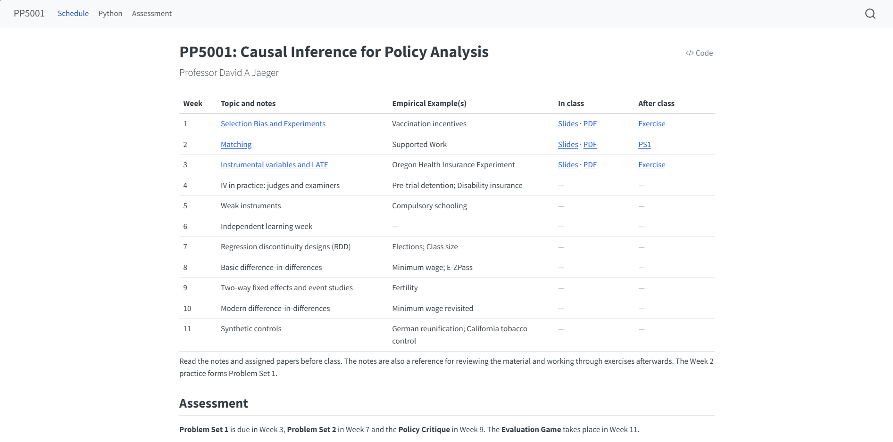
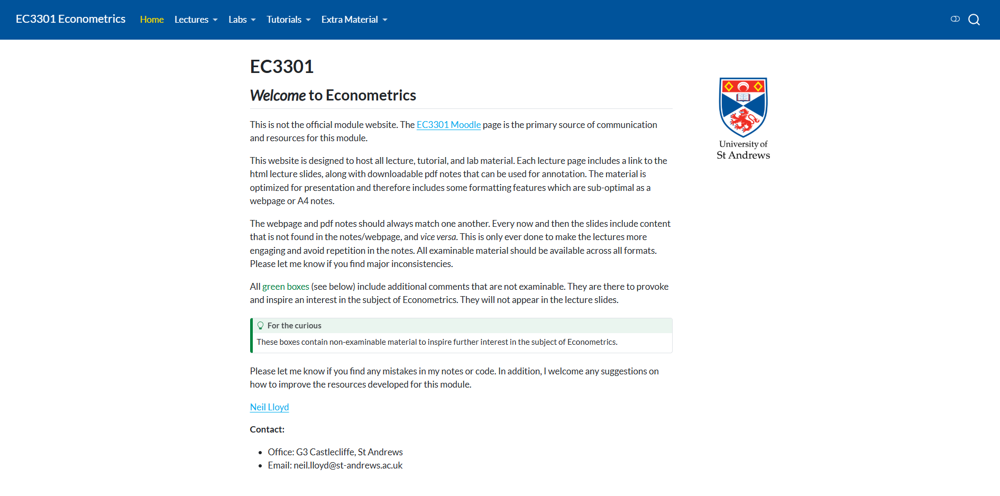
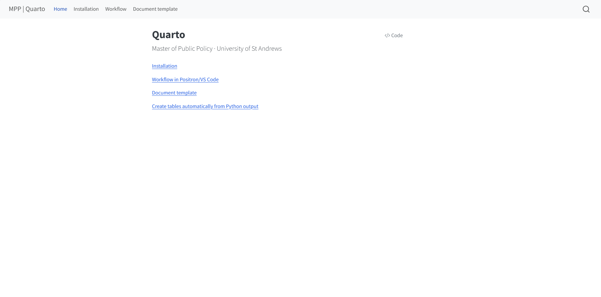

```{r}
#| include: false

library(Statamarkdown)
knitr::opts_chunk$set(collectcode = TRUE)
reticulate::use_condaenv("base")
```

## Posit

From the company that brought you RStudio, R Markdown, and more recently Positron, comes

{fig-align="center" width=20% .nostretch}

an open-source scientific and technical publishing system.


## Basics

Everything is prepared in a Quarto markdown file (`.qmd`). For example, 

````
## New slide title

Add a list of

1. item 1
2. item 2

   a. sub-item 1
   
Add some maths: $\hat{\beta}$ is defined as

$$
  \hat{\beta} = (X'X)^{-1}X'Y
$$

:::{.callout-note title="Important"}
This is the most important equation in this module.
:::
````

## New slide title

Add a list of

1. item 1
2. item 2

   a. sub-item 1
   
Add some maths: $\hat{\beta}$ is defined as

$$
  \hat{\beta} = (X'X)^{-1}X'Y
$$

:::{.callout-note title="Important"}
This is the most important equation in this module.
:::

# Here's a few things we've learnt... {.section}

## Code management and programming

Example: Luc's [PP5000 webpage](https://luc-bridet.github.io/PP5000-LB/){target="_blank"} 

{fig-align="center" width=70%}

## Content management and workflow

Example: David's [PP5001 webpage](https://www.djaeger.org/teaching/mpp/pp5001/){target="_blank"} 

{fig-align="center" width=70%}

## Design and formatting

Example: Neil's [EC3301 webpage](https://neil-lloyd.github.io/st-andrews-ec3301/){target="_blank"} 

{fig-align="center" width=70%}

# Summary

## Pros

1. **Accessibility:** Creating digital resources solves a well known problem of screen readibility of PDF documents. Solve this problem by publishing *simultaneously*

   - multiple formats: .docx, .pdf, .html, etc.

2. **Flexibility:** write in markdown, publish as website, document, presentations, blog, dashboard, etc.

   - more authentic and creative modes of assessment (in the age of AI)
   - more modern, engaging material

3. **Reproducibility:** Incorporate reproducible code directly into your documents. 

   - 'single source of truth'
   - using a range of languages: R, Python, Julia, even software like Stata
   - integration with AI-assisted workflow

4. **Interactivity:** Create "live" interactive documents that allow you to interact with data in real time. 


## Cons

Here are a few things you will need to consider:

- Formatting html documents requires the use of a CSS/SCSS style sheet 

  - AI can help with this, or just 'keep it simple stupid' 
  - Markdown is an intentionally simple (easy-to-learn) language 
  - Can enhance with html

- Coding within a markdown file requires the use of code blocks 

  - Not how you order research/analysis
  - Not *necessarily* how you want your students to engage with code
  - Debugging can be inefficient
  - Replacement more for .tex/.pptx than .do/.R/.py

  

## A quick guide:

David has created a helpful [Quarto (and Positron) guide](https://www.djaeger.org/teaching/mpp/quarto/){target="_blank"} for the MPP students:

{fig-align="center" width=70%}


# Questions

neil.lloyd\@st-andrews.ac.uk / [https://neil-lloyd.github.io/digital-resources/](https://neil-lloyd.github.io/digital-resources/)
david.jaeger\@st-andrews.ac.uk / [https://www.djaeger.org/teaching/mpp/quarto/](https://www.djaeger.org/teaching/mpp/quarto/)
luc.bridet\@st-andrews.ac.uk / 

