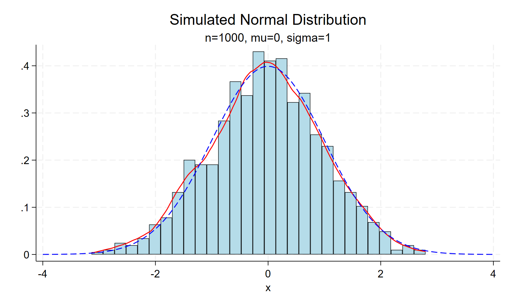
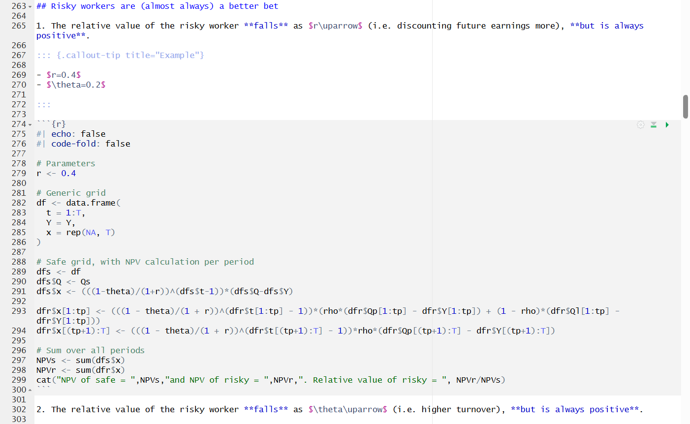
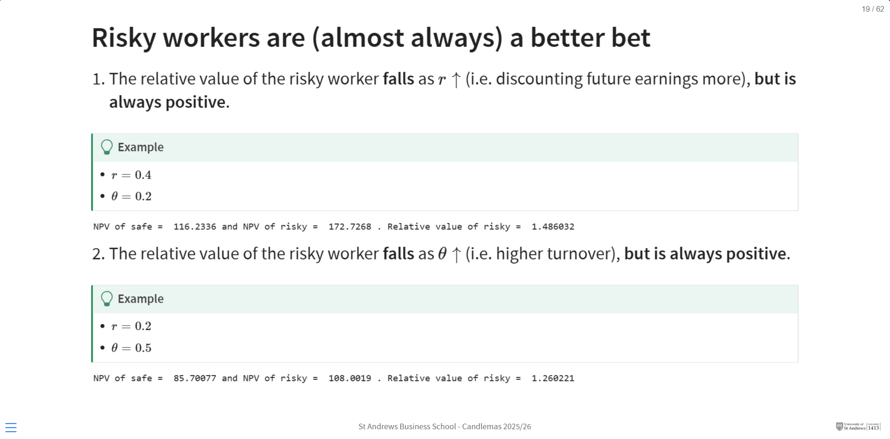
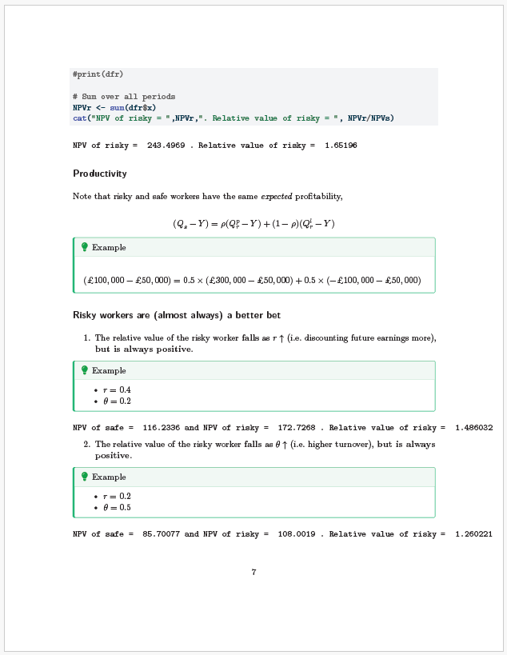
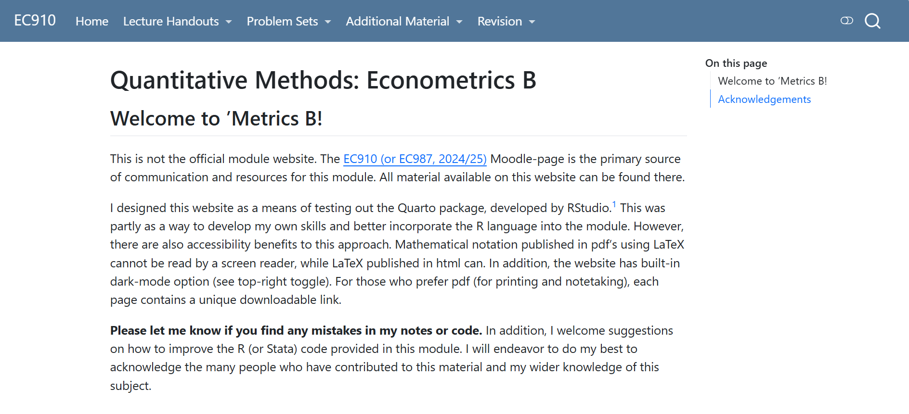

```{r}
#| include: false

library(Statamarkdown)
knitr::opts_chunk$set(collectcode = TRUE)
reticulate::use_condaenv("base")
```

## Posit

From the company that brought you RStudio, R Markdown, and more recently Positron, comes

{fig-align="center" width=20% .nostretch}

an open-source scientific and technical publishing system.


## Why?

1. **Accessibility:** Creating digital resources solves a well known problem of screen readibility of PDF documents. Solve this problem by publishing *simultaneously*

   - multiple formats: Word, PDF, HTML, etc.

2. **Flexibility:** write in markdown, publish as website, document, presentations, blog, dashboard, etc.

   - more authentic and creative modes of assessment (in the age of AI)
   - more modern, engaging material

3. **Reproducibility:** Incorporate reproducible code directly into your documents. 

   - along with data, tables, and figures
   - using a range of languages: R, Python, Julia, even software like Stata
   - sync changes through an online host (e.g. GitHub Pages)

4. **Interactivity:** Create "live" interactive documents that allow you to interact with data in real time. 

## Basics

Everything is prepared in a Quarto markdown file (`.qmd`). For example, 

````
## New slide title

Add a list of

1. item 1
2. item 2

   a. sub-item 1
   
Add some maths: $\hat{\beta}$ is defined as

$$
  \hat{\beta} = (X'X)^{-1}X'Y
$$

:::{.callout-note title="Important"}
This is the most important equation in this module.
:::
````

## New slide title

Add a list of

1. item 1
2. item 2

   a. sub-item 1
   
Add some maths: $\hat{\beta}$ is defined as

$$
  \hat{\beta} = (X'X)^{-1}X'Y
$$

:::{.callout-note title="Important"}
This is the most important equation in this module.
:::

# These are a few of my favourite things... {.section}

## \#1 LaTeX without *LaTeX*

LaTeX is *beautiful*, but LaTeX can also be a huge waste of time. And it's not really a skill our students need. 

](celpie-presentation/screenshot-pdf-example.png){fig-align="center" width=80%}


A nice feature of Quarto is that it supports LaTeX math syntax and will publish your documents PDFs simultaneously as HTML or Word, so you can have the best of both worlds.

## \#2 Incorporation of code

There is no better way to incorporate code into your teaching material, both from a design and feature perspective.[^1]

[^1]: See this [example](https://quarto.org/docs/presentations/revealjs/demo/#/pretty-code) from the [Quarto Gallery](https://quarto.org/docs/gallery/).

```{r}
#| echo: true
#| code-fold: false
#| warning: false
#| out-width: "60%"
#| fig-align: center

library(ggplot2)
ggplot(airquality, aes(Temp, Ozone)) + 
  geom_point() + 
  geom_smooth(method = "loess", se = FALSE)
```


## \#3 Multi-lingual documents {.scrollable}

There are some [caveats](https://neil-lloyd.github.io/digital-resources/language-test-3.html), but you can write documents in multiple languages. 

:::{.panel-tabset}

### R

```{r}
#| echo: true
#| code-fold: true
#| warning: false
#| fig-align: center

library(tibble)

set.seed(123)
n <- 1000
mu <- 0
sigma <- 1
df <- tibble(x = rnorm(n, mean = mu, sd = sigma))

gg <- ggplot(df, aes(x = x)) +
  geom_histogram(aes(y = ..density..), bins = 30, fill = "lightblue", color = "black", alpha = 0.6) +
  geom_density(color = "red", size = 1) +
  stat_function(fun = dnorm, args = list(mean = mu, sd = sigma), color = "blue", linetype = "dashed", size = 1) +
  labs(
    title = "Simulated Normal Distribution",
    subtitle = paste0("n = ", n, ", mu = ", mu, ", sigma = ", sigma),
    x = "x",
    y = "Density"
  ) +
  theme_minimal()
gg
```


### Python

```{python}
#| echo: true
#| code-fold: true
#| fig-align: center

import numpy as np
import seaborn as sns
import matplotlib.pyplot as plt

def plot_normal_sim(n=1000, mu=0.0, sigma=1.0, bins=30, seed=123):
    rng = np.random.default_rng(seed)
    x = rng.normal(loc=mu, scale=sigma, size=n)
    fig, ax = plt.subplots(figsize=(8, 5))
    sns.histplot(x, bins=bins, stat="density", color="lightblue", edgecolor="black", alpha=0.6, ax=ax)
    sns.kdeplot(x, color="red", linewidth=1.5, ax=ax)
    xs = np.linspace(x.min() - 1, x.max() + 1, 400)
    pdf = (1.0 / (sigma * np.sqrt(2 * np.pi))) * np.exp(-0.5 * ((xs - mu) / sigma) ** 2)
    ax.plot(xs, pdf, color="blue", linestyle="--", linewidth=1.5)
    ax.set_title(f"Simulated Normal Distribution\nn={n}, mu={mu}, sigma={sigma}")
    ax.set_xlabel("x")
    ax.set_ylabel("Density")
    fig.tight_layout()
    return fig
plot_normal_sim()
```

### Stata

```{stata}
#| echo: true
#| code-fold: true
#| output: false

set obs 1000
gen x = rnormal()
twoway (histogram x, fcolor(ltblue) lcolor(black)) (kdensity x, lcolor(red)) (function y=normalden(x), range(-4 4) lcolor(blue) lpattern(dash)), title("Simulated Normal Distribution") subtitle("n=1000, mu=0, sigma=1") legend(off)
graph export "celpie-presentation/stata_histogram.png", replace
```

{fig-align="center"}

:::


## \#4 Slides vs lecture notes, have *both*!

Unsure about making slides or lecture notes, make both **simulatenously**. 

:::{.panel-tabset}

### .qmd

{fig-align="center" width=60%}

### HTML slides

{fig-align="center" width=80%}


### PDF notes
{fig-align="center" width=30%}
:::

## \#5 Organization

Become a 'web developer' overnight and organize your materials as a website or e-book. 

{fig-align="center" width=70%}

This has *huge* benefits for students. You can add links in Moodle directly to your website, which then remain up to date.[^2]

[^2]: Quarto provides excellent guidance one how to host a site: [https://quarto.org/docs/websites/](https://quarto.org/docs/websites/) 


## Downsides

Here are a few things you will need to consider:

- Parcing settings to LaTeX appears to be tricky! (I've not even tried, yet.)

- Formatting html documents requires the use of a CSS/SCSS style sheet. 

  - AI can help with this. 

- Markdown is an intentionally simple (easy-to-learn) language, but it is not as featureful as LaTeX. 

  - Again, formatting comes through CSS. 
  
  - My least favourite feature is footnotes! 😔

- Coding within a markdown file requires the use of code blocks. 

  - Not *necessarily* how you want your students to engage with code. 

  - Can probably write a script to strip the code and create a .r/.py/.do script for your students to run.[^3]

[^3]: For example, I created a [script](https://neil-lloyd.github.io/digital-resources/language-test-4-multi.html) that turns multi-lingual html documents into separate language-specific PDFs.

# Questions

neil.lloyd\@st-andrews.ac.uk / [https://neil-lloyd.github.io/digital-resources/](https://neil-lloyd.github.io/digital-resources/)

